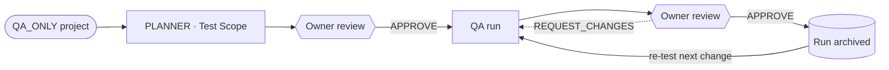
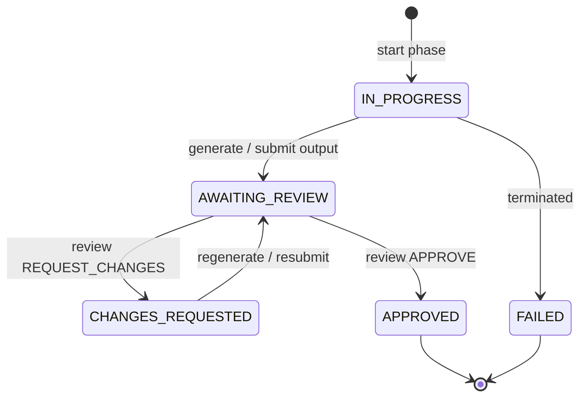
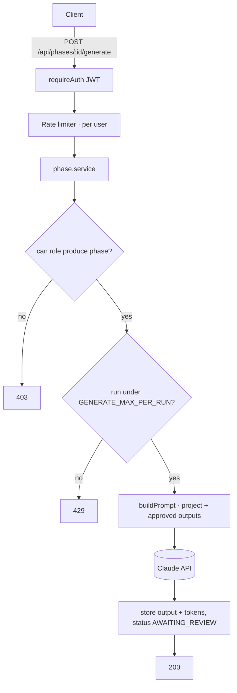

# VDT Platform (Virtual Development Team Platform)

Internal platform for **Code De Bear Company Limited** that automates the
`Planner → Dev → QA → Code Review → Docs` software-delivery workflow, using the
Claude / Anthropic API as the executing agent for each phase. Instead of running
the workflow by hand, a team creates a project, starts each phase, and lets the
platform generate review-ready output that a project owner approves before the
next phase begins.

The same engine also supports a **QA-only track** for clients who already have
code and just want independent, repeatable QA cycles with full run history.

## Overview

- **Backend:** Node.js 20 + TypeScript + Express, Prisma ORM, JWT auth.
- **Database:** Neon (managed serverless Postgres) — external, not co-located with the app.
- **AI:** Claude / Anthropic API (`@anthropic-ai/sdk`), default model `claude-sonnet-4-6`.
- **Deploy:** Docker (`node:20-slim` base) on a Raspberry Pi.
- **Frontend:** React + Vite — not yet built (API-only at this stage).

## Prerequisites

- Node.js 20+ (for local development without Docker).
- Docker + Docker Compose (for the standard deployment).
- A Neon Postgres connection string (`?sslmode=require`).
- An Anthropic API key — optional; required only to use the `/generate` endpoints.

## Quick start

```bash
git clone https://github.com/codedebear/vdt-platform.git
cd vdt-platform
cp .env.example .env        # then edit .env (see Environment variables)
docker compose up --build -d
```

The API is then available at `http://localhost:4000`. On first start the
container runs `prisma db push` to sync the schema to Neon, then boots the API.

For local development without Docker:

```bash
cd backend
npm install
npx prisma generate
npx prisma db push          # sync schema to the Neon DB in DATABASE_URL
npm run dev                 # starts the API on PORT (default 4000)
```

## Environment variables

Set these in `.env` at the repo root (next to `docker-compose.yml`). `.env` is
gitignored — copy `.env.example` and fill it in.

| Variable | Required | Default | Description |
|----------|----------|---------|-------------|
| `DATABASE_URL` | ✅ | — | Neon Postgres connection string; must end with `?sslmode=require`. |
| `JWT_SECRET` | ✅ | — | Secret for signing JWTs; **minimum 16 characters** (app refuses to boot otherwise). |
| `JWT_EXPIRES_IN` | — | `8h` | JWT lifetime (e.g. `8h`, `7d`). |
| `PORT` | — | `4000` | Port the API listens on. |
| `NODE_ENV` | — | `development` | `development` \| `test` \| `production`. |
| `ANTHROPIC_API_KEY` | ⚠️ | — | Anthropic key. App boots without it, but `/generate` returns `503` until set. |
| `ANTHROPIC_MODEL` | — | `claude-sonnet-4-6` | Model used for phase generation. |
| `ANTHROPIC_MAX_TOKENS` | — | `8000` | Max output tokens per generation. |
| `ANTHROPIC_TIMEOUT_MS` | — | `120000` | Per-request timeout to the Anthropic API. |
| `ANTHROPIC_MAX_RETRIES` | — | `2` | SDK retry budget on transient upstream errors. |
| `GENERATE_RATE_LIMIT_PER_MIN` | — | `10` | Per-user rate limit on `/generate` (requests/minute). |
| `GENERATE_MAX_PER_RUN` | — | `5` | Max (re)generations allowed for a single phase run before `429`. |

## Concepts

**Tracks** — a project is created with one of:

- `FULL_SDLC` — the full `Planner → Dev → QA → Code Review → Docs` flow.
- `QA_ONLY` — a lightweight planner produces a Test Scope, then repeatable QA cycles. QA runs can be re-executed many times with full history retained.

**Phase types:** `PLANNER`, `DEV`, `QA`, `CODE_REVIEW`, `DOCS`.

**Phase run lifecycle (`PhaseExecution.status`):**
`IN_PROGRESS → AWAITING_REVIEW → APPROVED` (or `CHANGES_REQUESTED` on a review
that requests changes, which can be resubmitted; `FAILED` for a terminated run).
Each *run* of a phase is a separate `PhaseExecution` row, so a phase can be
re-run (e.g. QA after a change request) without overwriting history.

**Roles (global, per user):**

| Role | Runs phases | Other rights |
|------|-------------|--------------|
| `SUPER_ADMIN` | any | override on everything |
| `PROJECT_OWNER` | — | create projects; review/approve runs of **own** projects |
| `BA` | `PLANNER` | — |
| `SA` | `DEV`, `CODE_REVIEW` | — |
| `QA` | `QA` | — |
| `OPERATION` (default) | `DOCS` | — |

New registrations are created as `OPERATION`. Role assignment is currently
manual (SQL `UPDATE "User" SET role = '<ROLE>' WHERE email = '<email>'`; see
`qa/seed-roles.sql`) — a user-management endpoint/UI is a planned follow-up.

## How it works

### FULL_SDLC phase flow

Each phase is produced by its worker role, then gated by the project owner's
review before the next phase can start. A change request loops back to the same
phase without losing history.

```mermaid
flowchart LR
    Start([Project created]) --> P[PLANNER · BA]
    P --> Pg{{Owner review}}
    Pg -->|APPROVE| D[DEV · SA]
    Pg -.REQUEST_CHANGES.-> P
    D --> Dg{{Owner review}}
    Dg -->|APPROVE| Q[QA · QA]
    Dg -.REQUEST_CHANGES.-> D
    Q --> Qg{{Owner review}}
    Qg -->|APPROVE| C[CODE_REVIEW · SA]
    Qg -.REQUEST_CHANGES.-> Q
    C --> Cg{{Owner review}}
    Cg -->|APPROVE| Doc[DOCS · OPERATION]
    Cg -.REQUEST_CHANGES.-> C
    Doc --> Dog{{Owner review}}
    Dog -->|APPROVE| Done([Project complete])
    Dog -.REQUEST_CHANGES.-> Doc
```



The `QA_ONLY` track is a shorter loop: a lightweight `PLANNER` (Test Scope) is
approved, then `QA` runs repeat as many times as needed (re-test on every code
change), each run kept in history.



### Per-run lifecycle (`PhaseExecution.status`)

Every *run* of a phase is its own row. Output is produced either by Claude
(`/generate`) or submitted manually (`/output`), then reviewed.



### Request path for AI generation



## API Reference

Base URL: `http://localhost:4000`. All `/api/*` routes except auth require an
`Authorization: Bearer <token>` header. Request/response bodies are JSON.

### Auth

#### `POST /api/auth/register`
Registers a new user (always created with role `OPERATION`).
**Request body:**
```json
{ "email": "user@codedebear.com", "password": "min-8-chars", "name": "Full Name" }
```
**Response:** `201 Created`
```json
{
  "user": { "id": "...", "email": "user@codedebear.com", "name": "Full Name", "role": "OPERATION" },
  "token": "<jwt>"
}
```
Errors: `409` email already registered, `422` validation failed.

#### `POST /api/auth/login`
Authenticates and returns a signed JWT.
**Request body:**
```json
{ "email": "user@codedebear.com", "password": "..." }
```
**Response:** `200 OK` (same shape as register). Errors: `401` invalid credentials.

### Projects
All routes require authentication.

#### `POST /api/projects`
Creates a project owned by the caller. Requires the `PROJECT_CREATE` permission
(`PROJECT_OWNER` or `SUPER_ADMIN`).
**Request body:**
```json
{ "name": "Client X Platform", "description": "optional", "track": "FULL_SDLC" }
```
`track` is `FULL_SDLC` or `QA_ONLY`.
**Response:** `201 Created` with the project. Errors: `403` insufficient role, `422` validation failed.

#### `GET /api/projects`
Lists all projects. **Response:** `200 OK` with an array of projects.

#### `GET /api/projects/:id`
Fetches one project with its phase executions and the suggested next phase.
**Response:** `200 OK`. Errors: `404` not found.

#### `POST /api/projects/:id/phases`
Starts a new run of a phase. Authorized per phase-type in the service layer
(the caller's role must be the worker role for `phaseType`).
**Request body:**
```json
{ "phaseType": "PLANNER", "input": "optional SRS / endpoint list / context" }
```
**Response:** `201 Created` with the new `PhaseExecution` (`status: IN_PROGRESS`).
Errors: `403` role not allowed, `404` project missing, `409` phase cannot start now.

### Phases
All routes require authentication and act on an existing execution id.

#### `POST /api/phases/:executionId/generate`
Generates this run's output via Claude, then moves the run to `AWAITING_REVIEW`.
The prompt is built from project context plus the approved outputs of earlier
phases. **Per-user rate-limited** and **capped per run** (`GENERATE_MAX_PER_RUN`).
**Request body:** none.
**Response:** `200 OK` with the updated execution (output + token usage).
Errors: `403` role not allowed, `404` missing, `409` invalid status,
`429` rate limit or per-run cap reached, `502` upstream generation failed,
`503` `ANTHROPIC_API_KEY` not configured.

#### `POST /api/phases/:executionId/output`
Submits a run's output manually (override / when not using AI generation), moving
it to `AWAITING_REVIEW`. Allowed while `IN_PROGRESS` or `CHANGES_REQUESTED`.
**Request body:**
```json
{ "output": "the deliverable markdown (min 1 char)" }
```
**Response:** `200 OK`. Errors: `403`, `404`, `409`, `422`.

#### `POST /api/phases/:executionId/review`
Applies a human review decision. Only the project owner (or `SUPER_ADMIN`) may
review. `APPROVE` marks the run `APPROVED` and stamps `completedAt`;
`REQUEST_CHANGES` marks it `CHANGES_REQUESTED`.
**Request body:**
```json
{ "action": "APPROVE", "note": "optional reviewer note" }
```
`action` is `APPROVE` or `REQUEST_CHANGES`.
**Response:** `200 OK`. Errors: `403`, `404`, `409` (not awaiting review), `422`.

### Health

#### `GET /health`
Liveness probe (no auth). **Response:** `200 OK` `{ "status": "ok" }`.

## Running tests

```bash
cd backend
npm test                    # Jest unit + integration tests
```

Pure-domain engines (`workflow`, `permissions`, `prompts`) and the generation
service are unit-tested in isolation; `health` is covered with supertest.
End-to-end smoke scripts live in `qa/` (`smoke-phase2.sh`, `smoke-phase2.5.sh`,
`smoke-phase3.sh`) and run against a deployed instance.

## Deployment

See [DEPLOY.md](./DEPLOY.md) for the full Raspberry-Pi + Docker + Neon runbook
(clone, create `.env`, `docker compose up --build -d`, verify, and ops
commands). In short:

```bash
# on the Pi
cd ~/vdt-platform && git pull origin main
cp .env.example .env        # first time only; then edit
docker compose up --build -d
docker compose logs -f backend
```

Database schema changes are applied via `prisma db push` (run automatically in
the container start, or manually for local dev). The Anthropic key and Neon
credentials live only in `.env` on the host — never committed.
